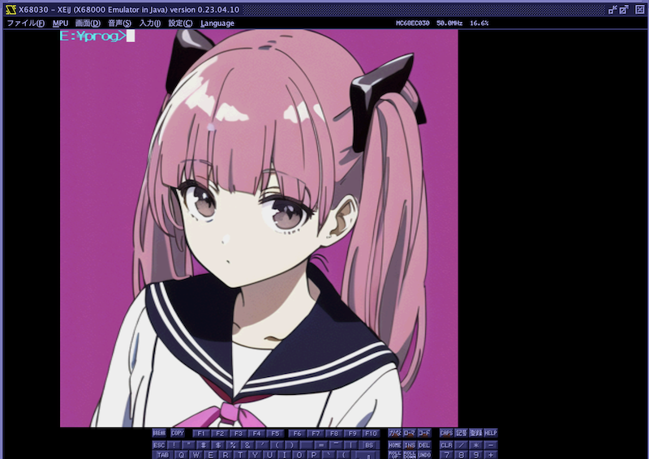
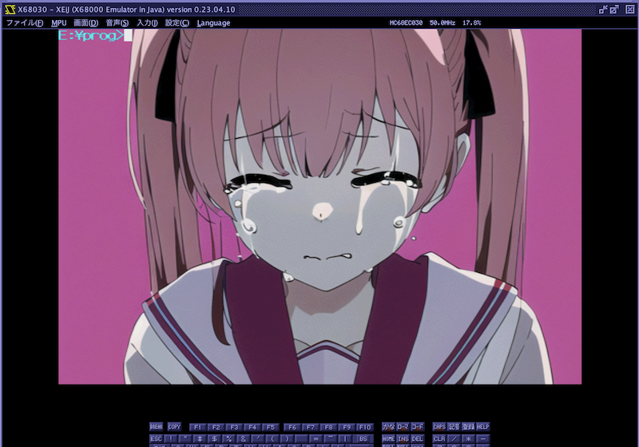
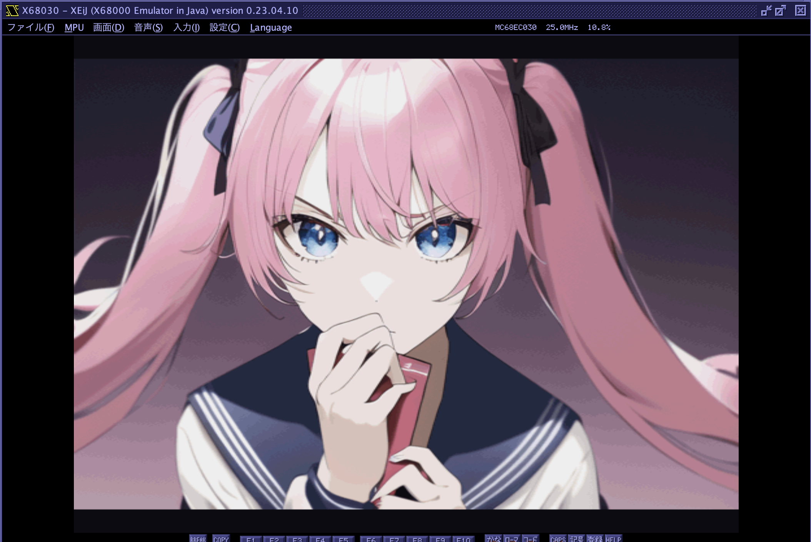
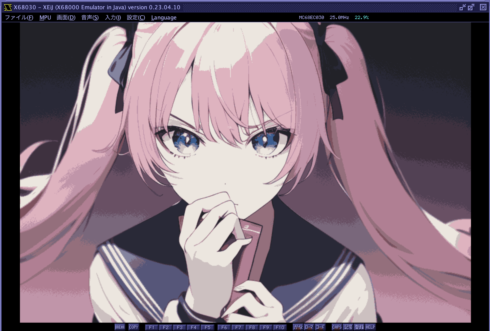
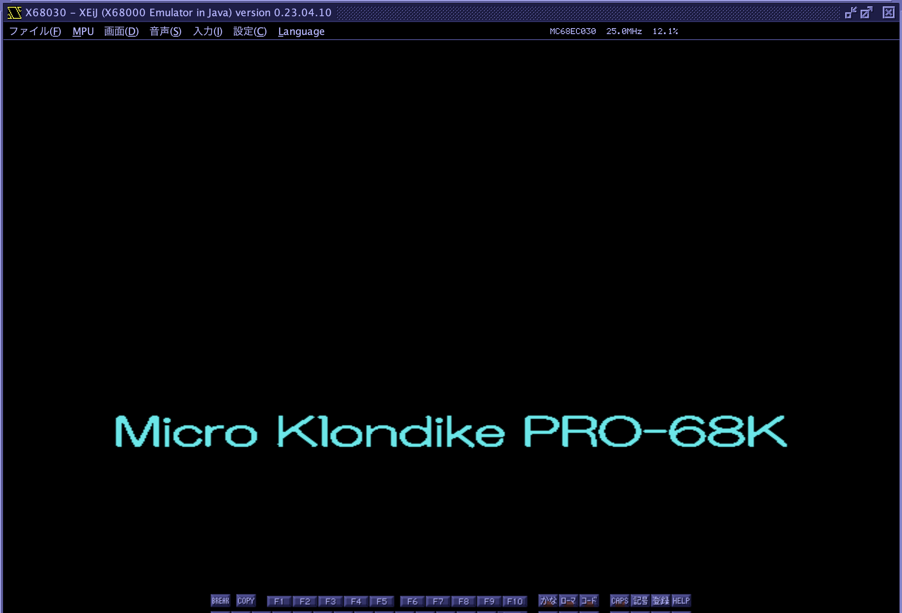

# png2grm
PNG to 16bit X68k GVRAM format converter

---

### Install

    pip install git+https://github.com/tantanGH/png2grm.git

参考：[Windowsユーザ向けPython導入ガイド](https://github.com/tantanGH/distribution/blob/main/windows_python_for_x68k.md)

---

### Usage

    png2grm [options] <input-png-file> <output-grm-file>

Input PNG file can be RGB PNG or RGBA transparent PNG either.

    options:
        -x [width]       ... 出力横サイズ
        -y [height]      ... 出力縦サイズ
        -c [colors]      ... 65536(default), 256, 16
        -t               ... TVRAM形式で書き出す(-cは無視して2値化)
        -h               ... ヘルプメッセージの表示

---

### 使用例1

- 縦640ピクセル、横640ピクセルの1:1PNG画像をX68000 512x512x65536色モードでできるだけアスペクト比を維持しながら表示させたい場合

横384ピクセル、縦512ピクセルで出力する。これより小さいサイズにする場合はこの比率(3:4)を維持する。

        png2grm -x 384 -y 512 sample1.png sample1.grm

X68000側で MicroPython を使って表示する例

        import x68k

        x68k.crtmod(12,True)

        gvram = x68k.GVRam()
        with open("sample1.grm", "rb") as f:
          for y in range(0, 512, 64):
            grm_data = f.read(2 * 384 * 64)
            gvram.put(0, y, 383, y + 63, grm_data)

注意：X68000の512x512モードのアスペクト比は3:2と言われているが、これはブラウン管(CRT)で周辺の歪みを避けるためにオーバースキャン気味に設定されていたためと思われる。

注意：X68000Z EAKは意図的にやや横長に表示するようになっており、上記設定で実行するとやや横に潰れた形となる。X68000Z での表示を優先するならば横幅 342px 程度に収める。

---

### 使用例2

- 横768ピクセル、縦512ピクセルの3:2PNG画像をX68000 512x512x65536色モードでできるだけアスペクト比を維持しながら表示させたい場合

横512ピクセル、縦456ピクセルで出力する。これより小さいサイズにする場合はこの比率(約8:7)を維持する。

        png2grm -x 512 -y 456 sample2.png sample2.grm

X68000側で MicroPython を使って表示する例

        import x68k

        x68k.crtmod(12,True)

        gvram = x68k.GVRam()
        with open("sample2.grm", "rb") as f:
          for y in range(0, 456, 8):
            grm_data = f.read(2 * 512 * 8)
            gvram.put(0, y, 511, y + 7, grm_data)

もし高さを16の倍数として扱い易くしたい場合は縦464ピクセルでもほぼ問題ない。

        png2grm -x 512 -y 464 sample2.png sample2.grm

X68000側で MicroPython を使って表示する例

        import x68k

        x68k.crtmod(12,True)

        gvram = x68k.GVRam()
        with open("sample2.grm", "rb") as f:
          for y in range(0, 464, 16):
            grm_data = f.read(2 * 512 * 16)
            gvram.put(0, 24 + y, 511, 24 + y + 15, grm_data)

注意：X68000Z EAKは意図的にやや横長に表示するようになっており、上記設定で実行するとやや横に潰れた形となる。X68000Z での表示を優先するならば縦幅 512px とする。

---

### 使用例3

- 横768ピクセル、縦512ピクセルの3:2PNG画像をX68000 512x512x256色パレットモードでできるだけアスペクト比を維持しながら表示させたい場合

        png2grm -x 512 -y 464 -c 256 sample3.png sample256.grm

このモードの場合は、先頭に 2 * 256 byte のパレットデータが付加される。その後は 1 dot = 1 byte のデータが続く。

X68000側で MicroPython を使って表示する例

        import x68k

        x68k.crtmod(8,True)

        gvram = x68k.GVRam()
        with open("sample256.grm", "rb") as f:
          pal_data = f.read(2 * 256)
          for i in range(256):
            col = int.from_bytes(pal_data[ i * 2 : i * 2 + 2 ], 'big')
            gvram.palet(i, col)
          grm_data = f.read(1 * 512 * 464)
          gvram.put(0, 24, 511, 24 + 463, grm_data)

---

### 使用例4

- 横768ピクセル、縦512ピクセルの3:2PNG画像をX68000 768x512x16色パレットモードで画面全体に表示させたい場合

        png2grm -x 768 -y 512 -c 16 sample3.png sample16.grm

このモードの場合は、先頭に 2 * 16 byte のパレットデータが付加される。その後は 2 dot = 1 byte のデータが続く。

X68000側で MicroPython を使って表示する例

        import x68k

        x68k.crtmod(16,True)

        gvram = x68k.GVRam()
        with open("sample16.grm", "rb") as f:
          pal_data = f.read(2 * 16)
          for i in range(16):
            col = int.from_bytes(pal_data[ i * 2 : i * 2 + 2 ], 'big')
            gvram.palet(i, col)
          grm_data = f.read(1 * 768 * 512 // 2)
          gvram.put(0, 0, 767, 511, grm_data)

---

### 使用例5

- 横512ピクセル、縦85ピクセルのPNG画像を2値化してX68000 テキストプレーン0に表示させたい場合

        png2grm -x 512 -y 85 -t sample4.png samplet.trm

このモードの場合は、先頭に 横幅(2 byte) + 縦幅(2 byte) のサイズデータが付加される。その後は 16 dot = 2 byte のデータが続く。
4プレーン16色ではなく、1プレーン分の2値データとなるので注意。

X68000側で MicroPython を使って表示する例

        import x68k

        x68k.crtmod(16,True)

        tvram = x68k.TVRam()
        with open("samplet.trm", "rb") as f:
          trm_data = f.read()
          tvram.put(0, 200, trm_data)

